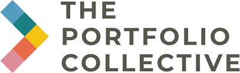

Hi! It's nice to e-meet you - I'm Sabina and...

...I'm currently:  
- working as a Freelance Data Analyst for [Frontline 100](https://www.frontline100.com/), [ARISTRA](https://aristra.com/), and [Permutable AI](https://permutable.ai/)
- working as a PT Lead Teacher at [Ironhack's](https://github.com/ironhack) Data Analytics bootcamp

...I have:
- worked as a Teaching Assistant at [Ironhack's](https://github.com/ironhack) Data Analytics bootcamp
- worked as a Financial Analyst at [Bernoulli Finance](https://www.bernoullifinance.com/)
- learnt Data Analytics using Python, MySQL & Tableau at [Ironhack](https://github.com/ironhack) 
- written a master thesis on organic chemistry methodology as part of the [Phipps group](https://phippsgroup.wixsite.com/home/alumni)
- studied Biological Natural Sciences at the University of Cambridge

Would you like to connect? Find me on:

